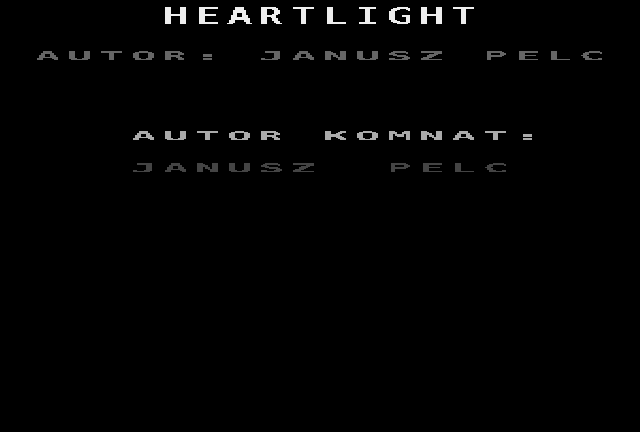
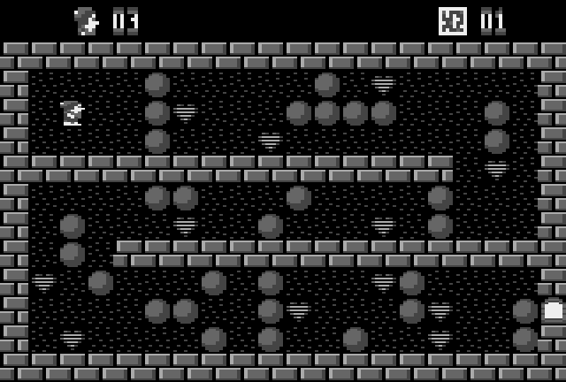

# Heartlight (Atari 8-bit, 1990) — conversion pipeline

Clean reconstruction of Janusz Pelc's *Heartlight* as published in
**Tajemnice ATARI 1/91** (type-in listing). Goal: a faithful, deterministic
engine in Python and later a pygame front end.

Original game: Janusz Pelc, (C) 1990 Tajemnice ATARI.
Conversion (extraction pipeline, disassembly, specification, engine and
pygame front end): **Quaerendir**.

## Files

| file | what |
|------|------|
| `1_91_heartlight.html` | the magazine article with the listing (UTF-8; source: unofficial TA archive, 2001) |
| `heartlight.bas` | the BASIC XL listing, identical to the article |
| `heartlight_extract.py` | stage 1: parses the listing, checksums the hex DATA, writes the files below |
| `levels.txt` | 4 rooms, 20×12 ASCII (`% # @ $ * ! & .`) |
| `meta.json` | colours, lives/extra/rooms, memory layout |
| `game.bin` | 6502 game code + charset, load `$9014`, entry `PLAY = $9260` |
| `loader.bin` | page-6 helper routines used only by the BASIC loader |
| `heartlight_disasm.py` | recursive-descent disassembler (needs `py65`) |
| `game.asm` | annotated disassembly of `game.bin` |
| `SPEC.md` | engine specification **v2**, every rule traced to a label in `game.asm` |
| `SPEC.v1.md` | earlier spec written from Boulder-Dash folklore, kept for the diff |
| `heartlight/engine.py` | stage 3: the engine, a literal re-implementation of the scan in `game.asm` |
| `tests/test_engine.py` | acceptance tests T1–T13 from `SPEC.md` §9 plus checks on the real rooms |
| `heartlight/render.py` | stage 4: charset from `game.bin`, GTIA palette, tile animation, POKEY channel emulation |
| `heartlight/play.py` | stage 4: the playable game (`heartlight` / `python -m heartlight.play`) |
| `heartlight/data/` | copies of `game.bin`, `meta.json`, `levels.txt` shipped inside the package |
| `docs/*.png` | screenshots rendered from the extracted data (title, curtain, rooms) |
| `tools/verify_timing.py` | runs the original loader and game code in py65 to confirm the timing constants |

## Usage

```
python3 heartlight_extract.py heartlight.bas          # -> levels.txt meta.json game.bin loader.bin
pip install py65
python3 heartlight_disasm.py game.bin 9464 940E 93C9 9402 93B3 93BF 93CE 947C 943B 9407 93B8 > game.asm
```
The hex arguments are the jump-table entries at `$98E0` (object handlers),
which control-flow analysis cannot reach on its own.

```
pip install pytest hypothesis mypy
python3 -m pytest -q          # 33 tests
python3 -m mypy heartlight/   # strict
```

```
pip install heartlight            # from PyPI: engine + front end + game data
heartlight [--scale 3] [--room 1] [--no-sound]
```
or from a checkout: `pip install pygame-ce` and `python3 -m heartlight.play`.
Title screen: Enter, Space, Shift or a joystick button (START/SHIFT/FIRE in
the original). In game: arrows / WASD / the original `- = + *`, joystick hat
or stick; ESC gives the room up (as in the original), Q quits; game over
returns to the title. The screen is the original layout: a 40x24 ANTIC
mode-4 playfield with 2x2 characters per cell, the mode-5 status line (hero
icon, lives, room), the five colour registers from `meta.json`, 6 frames per
tick at 50 Hz, and the room-loading curtain (25 frames of random soft-wall
cells, then 25 frames revealing the room). The title screen texts come from
`game.bin` and the banner from the level data; the original draws them with
the Atari OS charset, which is not part of this repository. Pass
`--os-font FILE` (a 1 KB charset dump or an XL/OS-B ROM image) for a
pixel-exact title, otherwise a system font stands in.





```python
from heartlight import Engine, Input, parse_levels
e = Engine(parse_levels(open('levels.txt').read()))
events = e.tick(Input.RIGHT)   # one physics scan; e.grid, e.state
```

## Memory map (from the BASIC loader, lines 230–240)

| address | content |
|---------|---------|
| `$0600` | loader routines (`loader.bin`) |
| `$7000` | lives, extra (rooms per bonus life), room count |
| `$7003` | title banner, 20 bytes |
| `$7017` | rooms, 240 bytes each, row-major |
| `$9000` | charset (first 20 bytes zeroed by the game), `game.bin` from `$9014` |
| `$9260` | `PLAY` entry |
| `$9B00` | screen (ANTIC mode 4) |
| `$9EC0` | 20×12 game grid |

## Status

Stage 1 done and verified (all 191 hex-line checksums pass, outputs reproduce
bit-for-bit). Stage 2 (disassembly) done. Stage 3 (engine) implemented and
tested against `SPEC.md`. Stage 4 (pygame) playable with title screen,
curtain and sound: `SND_REQ`/`SND_PLAY` are reproduced register for register
(priority per event, AUDF/AUDC tables, one PAL frame per blip, random pitch
for priority 3, blast frames getting louder) through a small POKEY channel
emulation (17/5/4-bit polynomial counters, 64 kHz divider). The timing
constants (11 scans of death sequence, tick counter starting at $4B, first
scan of a room without delay, 3 frames per curtain step) were confirmed by
running the original 6502 code in py65 (`tools/verify_timing.py`), which the
test suite repeats. Nothing in the reconstruction is guessed any more.

## License

The conversion (extractor, disassembler, engine, front end, tests, specs) is
released under the MIT licence, see `LICENSE`. The original game and the
material derived from it (`heartlight.bas`, the article, `game.bin`,
`levels.txt`, `game.asm`, screenshots) remain (C) 1990 Janusz Pelc /
Tajemnice ATARI and are included for preservation and study only, see
`NOTICE`.
